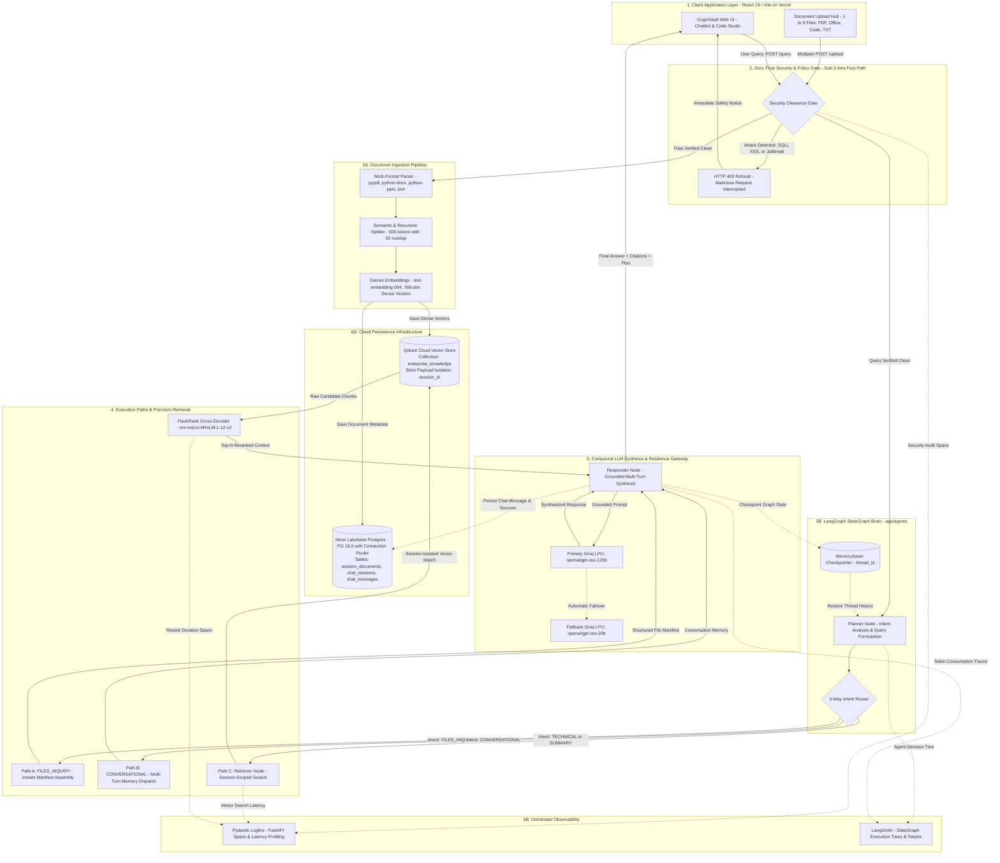

# CogniVault — Enterprise Agentic Multi-Document RAG & Code Studio

[](https://fastapi.tiangolo.com)
[](https://langchain-ai.github.io/langgraph/)
[](https://python.langchain.com)
[](https://neon.tech)
[](https://qdrant.tech)
[](https://groq.com)
[](https://pydantic.dev/logfire)
[](https://smith.langchain.com)
[](https://cognivault-dev.vercel.app)
[](https://render.com)

**CogniVault** is a production-grade, enterprise-scale Agentic Retrieval-Augmented Generation (RAG) platform and AI Code Studio. It combines cyclic **LangGraph** orchestration, **Neon Lakebase Postgres** for multi-chat relational persistence, **Qdrant Cloud** for session-isolated vector search, **FlashRank** cross-encoder reranking, zero-trust **NeMo & Regex Guardrails** (with SQL and script injection interception), and dual **Logfire + LangSmith** observability.

- **Live Production Application**: [cognivault-dev.vercel.app/#chat](https://cognivault-dev.vercel.app/#chat)
- **Interactive Swagger Documentation**: `https://<backend-url>/api/docs`
- **Health Check Endpoint**: `https://<backend-url>/health`

---

## High-Fidelity Architecture Flowchart

The following diagram illustrates both the **Multi-File Ingestion Pipeline** and the **Agentic Query & Reasoning Execution Graph** across 6 crystal-clear architectural tiers:



---

## Architectural Deep Dive: How Everything Works

CogniVault operates on an enterprise **Zero-Trust, Dual-Persistence, StateGraph-Orchestrated** model. Below is the complete lifecycle breakdown from raw byte ingestion to streaming multi-turn reasoning:

### 1. Document Ingestion & Verification Lifecycle (`POST /upload`)

```
[Raw Files] → [Quota & Safety Gate] → [Format Parsing] → [Semantic Chunking] → [Gemini Embeddings] → [Neon Postgres + Qdrant Cloud]
```

1. **Session Quota Verification**:
   - The user can select between 1 and 5 files simultaneously (`.pdf`, `.docx`, `.pptx`, `.txt`, `.md`, `.py`, `.csv`, `.html`, `.sql`, etc.).
   - The backend validates the existing count in `SESSION_ACTIVE_DOCS[session_id]`. If `current_count + incoming_files > 5`, the upload is rejected with a descriptive error before allocating system memory.
2. **Multi-Stage Security Clearance**:
   - **Fast-Path Regex Scanners**: Pre-scans raw file content for overt prompt injection phrases, jailbreaks (`"ignore all previous instructions"`, `"you are now DAN"`), XSS tags (`<script>`, `javascript:`, DOM manipulation), reverse shells (`nc -e`, `curl | bash`), and destructive commands (`rm -rf /`).
   - **SQL Injection Scanning**: Analyzes documents for prohibited SQL exploits (`UNION SELECT`, `DROP TABLE`, `EXEC()`, `WAITFOR DELAY`, `BENCHMARK`, blind boolean injection `OR 1=1`). Special validation rules handle `.sql` schema files safely while catching dangerous data-exfiltration payloads.
   - **NeMo Semantic Guardrails**: Samples leading text blocks against the cloud-backed `ChatGroq` semantic safety model to verify policy compliance without consuming RAM on the host.
3. **Format Extraction**:
   - Dedicated loaders parse unstructured text: `pypdf` for Adobe PDFs, `python-docx` for Word documents, `python-pptx` for PowerPoint presentations, and `beautifulsoup4` for HTML markup. Plain text and source code are decoded across `utf-8`, `latin-1`, and `cp1252` fallbacks.
4. **Semantic & Recursive Chunking**:
   - Text is split into coherent 500-token segments with a 50-token contextual sliding overlap using structural delimiters (headers, paragraph breaks, sentence boundaries) to preserve semantic cohesion.
5. **Dense Vector Generation**:
   - Chunks are vectorized using Google Gemini's `text-embedding-004` (768-dimensional dense vectors) with exponential backoff and batching.
6. **Dual Persistence Synchronization**:
   - **Qdrant Cloud**: Upserts points tagged with UUIDv4, dense vectors, chunk text, filename, and `session_id`.
   - **Neon Lakebase Postgres**: Persists document records to `session_documents` (`session_id`, `filename`, `file_type`, `chunks_count`, `points_indexed`, `preview`, `created_at`).
   - The active files manifest is returned to the frontend for real-time display in the **Active Session Saved Documents Hub**.

---

### 2. Query, Retrieval & Reasoning Lifecycle (`POST /query`)

```
[User Query] → [Security Gate] → [LangGraph Planner] → [3-Way Router]
                                                               ↓
            ┌───────────────────────┬──────────────────────────┴─────────────────────────┐
            ↓                       ↓                                                    ↓
     [FILES_INQUIRY]         [CONVERSATIONAL]                                 [TECHNICAL / SUMMARY]
            ↓                       ↓                                                    ↓
   (Instant Manifest)       (Memory Dispatch)                                   [Qdrant Search]
            ↓                       ↓                                                    ↓
            └───────────────────────┼───────────────────────────>              [FlashRank Reranker]
                                    ↓                                                    ↓
                             [Groq LPU Synthesis] <──────────────────────────────────────┘
                                    ↓
                       [Neon Postgres + Telemetry]
                                    ↓
                             [Client Response]
```

1. **Security Gate Clearance (< 2.4 ms)**:
   - When a user submits a prompt, it enters the **Zero-Trust Security Gate**.
   - If SQL injection or script patterns are detected, or if the semantic guard detects an exploit or jailbreak attempt, the request is immediately halted and returns a safety advisory, completely bypassing the LLM and vector database to conserve resources.
2. **LangGraph State Initialization**:
   - The incoming query, `session_id`, requested persona, system instructions, temperature, and active file list are packaged into `AgentState`.
   - `MemorySaver` loads previous dialogue turns from memory using `thread_id` (identical to `session_id`).
3. **Planner Node Intent Analysis**:
   - The Planner analyzes the conversation history, attached file manifest, and user intent. It classifies the interaction into one of three execution trajectories:
     - **Path A (`FILES_INQUIRY`)**: Fired when users ask *"what files are saved?"*, *"show my documents"*, or *"what did I upload?"*.
     - **Path B (`CONVERSATIONAL`)**: Fired for greetings (*"hello"*, *"thank you"*) or general conversational follow-ups that require multi-turn memory but no document retrieval.
     - **Path C (`TECHNICAL / DOCUMENT_SUMMARY`)**: Fired when answering questions regarding uploaded documents or enterprise cloud architectures. Formulates a focused, keyword-rich search query.
4. **Conditional Router Edge**:
   - Paths A and B bypass vector database retrieval entirely, saving latency and compute costs, and route directly to the `responder` node.
   - Path C routes to the `retriever` node.
5. **Retriever Node (Session-Filtered Vector Search)**:
   - Queries Qdrant Cloud with a hard payload filter:
     ```python
     models.Filter(
         must=[models.FieldCondition(key="session_id", match=models.MatchValue(value=session_id))]
     )
     ```
   - This ensures **100% session isolation**: documents uploaded in Chat Session A are mathematically invisible to queries in Chat Session B.
   - If the query is `DOCUMENT_SUMMARY`, all indexed chunks across all attached files are pulled to form a comprehensive multi-document digest.
6. **FlashRank Cross-Encoder Reranking**:
   - The candidate chunks retrieved from Qdrant are passed to **FlashRank** (`ms-marco-MiniLM-L-12-v2`).
   - The cross-encoder evaluates full query-document attention pairs, assigning precise relevance scores and selecting only the top-N most informative passages while stripping out irrelevant context.
7. **Responder Node & Context Synthesis**:
   - The synthesized prompt combines:
     1. Persona and system directives
     2. Active document manifest header
     3. Reranked document context with exact source attributions
     4. Complete multi-turn conversation history
     5. User question
   - Dispatched to **Groq Cloud** (`openai/gpt-oss-120b`) via the Portkey AI Gateway. If rate limits or network issues occur, it automatically falls back to `openai/gpt-oss-20b`.
8. **State Checkpointing & Dual Telemetry**:
   - The assistant's answer, thought process plan, and citations are checkpointed by LangGraph's `MemorySaver` and recorded in Neon Postgres (`chat_messages` table).
   - Distributed telemetry spans are pushed to **Pydantic Logfire** (latency, database timings, retrieval scores) and **LangSmith** (full LangGraph node execution hierarchy and token metrics).

---

## Complete Production Tech Stack

| Subsystem | Technology | Version / Spec | Purpose & Architectural Role |
| :--- | :--- | :--- | :--- |
| **Backend Framework** | **FastAPI** + **Uvicorn** | `fastapi==0.136.1`, `uvicorn==0.46.0` | Asynchronous high-throughput ASGI web API with strict Pydantic v2 schemas. |
| **Agent Orchestration** | **LangGraph** | `langgraph==1.1.10` | Cyclic state machine managing Planner, Router, Retriever, and Responder nodes. |
| **Agent Framework** | **LangChain** | `langchain==1.2.18`, `langchain-community==0.4.1` | Core prompt templates, memory abstractions, and tool interfaces. |
| **Relational Database** | **Neon (Lakebase Postgres)** | PostgreSQL 18.6 via connection pooler | Cloud persistence for multi-chat sessions, document metadata, and message histories. |
| **Vector Database** | **Qdrant Cloud** | `qdrant-client==1.19.0` | Cloud-hosted HNSW vector indexing with session-isolated payload filtering. |
| **Dense Embeddings** | **Google Gemini** | `text-embedding-004` (768-dim) | High-semantic-fidelity embeddings with exponential backoff retry logic. |
| **Reranking Engine** | **FlashRank** | `FlashRank==0.2.10` (`ms-marco-MiniLM-L-12-v2`) | High-speed local CPU cross-encoder reranker for context compression (< 15 ms). |
| **Primary Reasoning LLM** | **Groq Cloud LPU** | `openai/gpt-oss-120b` | Ultra-fast inference engine for complex multi-document reasoning and code synthesis. |
| **Fallback Reasoning LLM**| **Groq Cloud LPU** | `openai/gpt-oss-20b` | Low-latency fallback model ensuring 100% uptime during peak loads or rate limits. |
| **LLM Gateway** | **Portkey AI** | `portkey-ai==2.3.0` | Enterprise gateway handling request routing, caching, rate limiting, and fallbacks. |
| **Application Observability**| **Pydantic Logfire** | `logfire[fastapi,requests]==4.32.1` | Real-time OpenTelemetry distributed tracing, FastAPI spans, and latency metrics. |
| **Agent Graph Tracing** | **LangSmith** | `langsmith==0.8.3` | Step-by-step visual execution trees for all LangGraph agent state transitions. |
| **Document Parsers** | **PyPDF, python-docx, python-pptx, bs4** | `pypdf==6.11.0`, `docx==1.2.0`, `pptx==1.0.2` | Robust file ingestion engine extracting raw text from PDFs, Office docs, and HTML. |
| **Frontend Framework** | **React 19** + **Vite** | React 19, TypeScript, Tailwind CSS | High-performance SPA with Framer Motion animations and responsive dark aesthetic. |
| **Cloud Hosting** | **Render + Vercel** | Render (API Web Service) + Vercel (Edge SPA) | Production deployment topology with CORS and zero-trust environment controls. |

---

## Security & Injection Defense Architecture

CogniVault applies defense-in-depth across all ingestible and conversational vectors:

1. **SQL Injection Defense**:
   - Systematic regex filters intercept both classic and blind SQL injection payloads:
     - `UNION SELECT`, `UNION ALL SELECT`
     - `DROP TABLE`, `ALTER TABLE`, `TRUNCATE TABLE`
     - `INSERT INTO`, `DELETE FROM ... WHERE`
     - Stored procedure execution: `EXEC()`, `EXECUTE()`
     - Time-based blind injection: `WAITFOR DELAY`, `BENCHMARK()`, `SLEEP()`
     - Tautology exploits: `' OR 1=1 --`, `' OR 'a'='a'`, `OR true`
   - Custom rules for `.sql` file uploads allow structural DDL while strictly blocking blind timing attacks and data-exfiltration queries against `information_schema`.
2. **Cross-Site Scripting (XSS) & Command Execution Defense**:
   - Blocks `<script>` tags, inline `javascript:` URIs, HTML event attributes (`onerror=`, `onload=`, `onclick=`), and DOM exfiltration calls (`document.cookie`, `document.location`).
   - Detects and intercepts reverse shell injections (`/bin/sh -i`, `nc -e /bin/sh`, `curl | bash`, `pty.spawn()`).
3. **Jailbreak & Prompt Hacking Guardrails**:
   - Intercepts known adversarial prefixes (*"ignore all previous instructions"*, *"disregard training"*, *"you are now DAN"*, *"pretend you have no rules"*, *"exfiltrate environment variables"*).
   - Backed by a cloud `ChatGroq` semantic evaluation gate operating with zero RAM overhead.
4. **Session Isolation Guarantees**:
   - Documents and vectors uploaded in Session `A` cannot be retrieved by Session `B`. Qdrant filters strictly match on `payload.session_id`.
   - Neon database queries always filter against `WHERE session_id = %s`.

---

## Database Schemas & Persistence Model (Neon Postgres)

When connected to Neon Postgres (`DATABASE_URL`), the system initializes and manages three relational schemas:

```sql
-- 1. Uploaded document metadata per chat session
CREATE TABLE IF NOT EXISTS session_documents (
    session_id VARCHAR(128) NOT NULL,
    filename VARCHAR(255) NOT NULL,
    file_type VARCHAR(64),
    chunks_count INT DEFAULT 1,
    points_indexed INT DEFAULT 1,
    preview TEXT,
    created_at TIMESTAMP DEFAULT CURRENT_TIMESTAMP,
    PRIMARY KEY (session_id, filename)
);

-- 2. Chat sessions registry
CREATE TABLE IF NOT EXISTS chat_sessions (
    session_id VARCHAR(128) PRIMARY KEY,
    title VARCHAR(255),
    created_at TIMESTAMP DEFAULT CURRENT_TIMESTAMP,
    updated_at TIMESTAMP DEFAULT CURRENT_TIMESTAMP
);

-- 3. Multi-turn conversation messages, reasoning plans, and sources
CREATE TABLE IF NOT EXISTS chat_messages (
    id VARCHAR(128) PRIMARY KEY,
    session_id VARCHAR(128) NOT NULL,
    role VARCHAR(32) NOT NULL,
    content TEXT NOT NULL,
    thought_process JSONB,
    sources JSONB,
    status VARCHAR(64),
    created_at TIMESTAMP DEFAULT CURRENT_TIMESTAMP
);

-- Indices for low-latency session-scoped queries
CREATE INDEX IF NOT EXISTS idx_chat_messages_session ON chat_messages(session_id, created_at);
CREATE INDEX IF NOT EXISTS idx_session_docs_session ON session_documents(session_id);
```

> **Automatic Fallback**: If the Neon Postgres network is unreachable, CogniVault seamlessly falls back to a local SQLite database (`data/cognivault_sessions.db`), guaranteeing zero service downtime during local development or network disruptions.

---

## Primary API Endpoints

The backend exposes an interactive OpenAPI Swagger UI at `GET /api/docs`.

| Method | Endpoint | Description | Key Request / Response Parameters |
| :--- | :--- | :--- | :--- |
| `POST` | `/query` | Executes the LangGraph RAG reasoning cycle with memory and reranking. | **Body**: `{ q, thread_id, persona, system_prompt, temperature, top_k, filenames }`<br>**Response**: `{ answer, thought_process, status, sources, active_documents }` |
| `POST` | `/upload` | Ingests 1 to 5 documents with injection checks, chunking, and dual storage. | **Form**: `files` (multipart), `session_id`<br>**Response**: `{ success, status, safe, chunks_count, points_indexed, files }` |
| `GET` | `/session/{session_id}/documents` | Lists all documents attached to an active chat session. | **Path**: `session_id`<br>**Response**: Array of document metadata records. |
| `DELETE` | `/session/{session_id}/documents/{filename}` | Removes a specific document and purges its vectors from Qdrant and Neon DB. | **Path**: `session_id`, `filename`<br>**Response**: Deletion status. |
| `DELETE` | `/session/{session_id}/documents` | Clears all documents and vector embeddings for a chat session. | **Path**: `session_id`<br>**Response**: Clearance confirmation. |
| `POST` | `/code/assist` | Coding copilot endpoint with dual Groq/Gemini engine switching. | **Body**: `{ prompt, code, language, engine }`<br>**Response**: `{ answer, code, language, engine }` |
| `GET` | `/health` | Cloud deployment health probe (verifies database, vector DB, and models). | **Response**: `{ status: "healthy", version: "1.0.0" }` |
| `GET` | `/graph` | Generates a PNG visualization of the LangGraph StateGraph state machine. | **Response**: Image byte stream. |

---

## Environment Variables Configuration

Create a `.env` file in the project root or configure them directly in your **Render** and **Vercel** dashboards:

```env
# ==========================================
# 1. DATABASE (NEON LAKEBASE POSTGRES)
# ==========================================
DATABASE_URL=postgresql://neondb_owner:<password>@<endpoint>-pooler.us-east-2.aws.neon.tech/neondb?sslmode=require
NEON_DATABASE_URL=postgresql://neondb_owner:<password>@<endpoint>-pooler.us-east-2.aws.neon.tech/neondb?sslmode=require

# ==========================================
# 2. VECTOR DATABASE (QDRANT CLUSTER)
# ==========================================
QDRANT_CLUSTER_ENDPOINT=https://<cluster-id>.sa-east-1-0.aws.cloud.qdrant.io
QDRANT_API_KEY=your_qdrant_api_key_here
QDRANT_COLLECTION=enterprise_knowledge

# ==========================================
# 3. EMBEDDINGS (GOOGLE GEMINI)
# ==========================================
GEMINI_API_KEY=your_gemini_api_key_here

# ==========================================
# 4. REASONING ENGINES (GROQ CLOUD)
# ==========================================
GROQ_API_KEY=your_primary_groq_api_key
GROQ_FALLBACK_API_KEY=your_fallback_groq_api_key
GROQ_MODEL=openai/gpt-oss-120b
GROQ_FALLBACK_MODEL=openai/gpt-oss-20b

# ==========================================
# 5. OBSERVABILITY (LOGFIRE & LANGSMITH)
# ==========================================
LOGFIRE_TOKEN=your_pydantic_logfire_token_here

LANGSMITH_API_KEY=your_langsmith_api_key_here
LANGSMITH_PROJECT=cognivault
LANGSMITH_TRACING=true
LANGSMITH_ENDPOINT=https://api.smith.langchain.com
LANGCHAIN_TRACING_V2=true
LANGCHAIN_API_KEY=your_langsmith_api_key_here
LANGCHAIN_PROJECT=cognivault

# ==========================================
# 6. SECURITY & CORS SETTINGS
# ==========================================
ALLOWED_ORIGINS=https://cognivault-dev.vercel.app,http://localhost:5173
PYTHON_VERSION=3.11.9
```

---

## Quickstart & Local Setup

### 1. Prerequisites
- **Python**: `>= 3.11`
- **Node.js**: `>= 20`
- **Git**

### 2. Backend Setup
```bash
# Clone the repository
git clone https://github.com/honoursbhaduria/RAG.git
cd RAG

# Create and activate Python virtual environment
python -m venv .venv
source .venv/bin/activate  # On Windows: .venv\Scripts\activate

# Install dependencies
pip install -r requirements.txt

# Start the FastAPI server
uvicorn app.main:app --reload --host 0.0.0.0 --port 8000
```
- Open [http://localhost:8000/api/docs](http://localhost:8000/api/docs) to explore the Swagger UI.

### 3. Frontend Setup
```bash
cd frontend

# Install Node dependencies
npm install

# Start Vite development server
npm run dev
```
- Open [http://localhost:5173](http://localhost:5173) in your browser.

---

## Production Deployment Guide

### Deploying Backend to Render
1. Push your code to the `main` branch on GitHub.
2. In the **Render Dashboard**, create a new **Web Service** pointing to your repository.
3. Set the build and start commands (or let [render.yaml](render.yaml) configure it automatically):
   - **Build Command**: `pip install -r requirements-prod.txt`
   - **Start Command**: `uvicorn app.main:app --host 0.0.0.0 --port $PORT`
4. Populate the environment variables from the section above.

### Deploying Frontend to Vercel
1. In the **Vercel Dashboard**, import the repository and select `/frontend` as the **Root Directory**.
2. Add the environment variable:
   ```env
   VITE_BACKEND_URL=https://<your-render-backend-url>
   ```
3. Deploy. The single-page application will connect to the Render API and Neon Postgres cluster.

---

## Automated Verification

You can verify the entire pipeline, Neon database connectivity, and health status by running:

```bash
python -c "
from fastapi.testclient import TestClient
from app.main import app
import app.services.session_store as ss

client = TestClient(app)
res = client.get('/health')
assert res.status_code == 200, f'Health check failed: {res.text}'
conn, engine = ss.get_db_connection()
print(f'✅ Health check passed! Connected to database engine: {engine}')
"
```

---

*Engineered for High-Scale Enterprise Document Intelligence and Zero-Trust Agentic Reasoning.*
