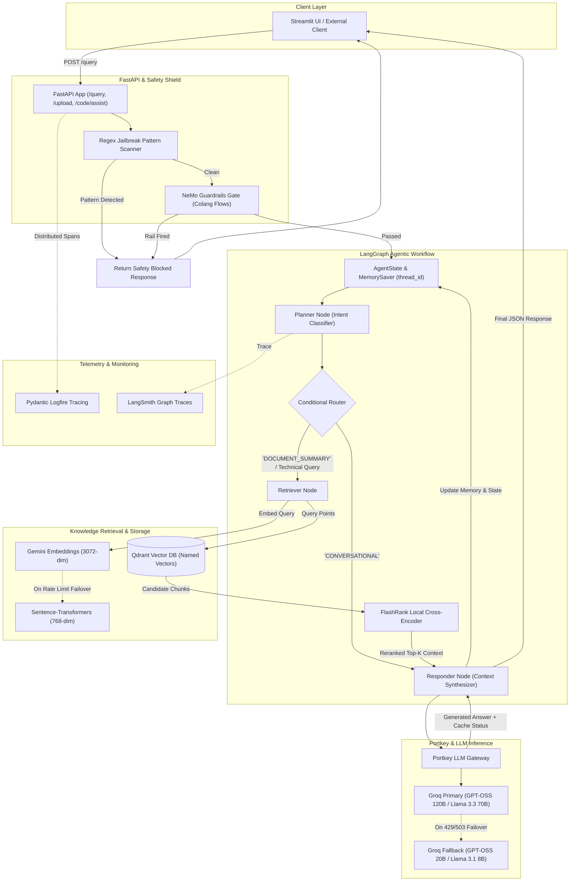
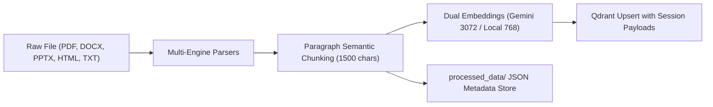

# 🏛️ Enterprise Agentic RAG — Comprehensive Backend Architecture & Technical Reference

This document provides an exhaustive, in-depth architectural and technical breakdown of the Enterprise Agentic RAG backend located in the `/app` directory of this repository.

---

## 1. 🌟 Executive Summary & System Purpose

The backend is an **Enterprise-Grade Agentic Retrieval-Augmented Generation (RAG) System** engineered for high scalability, fault tolerance, strict security guardrails, and deterministic multi-turn conversations.

Unlike basic, naive RAG pipelines that execute flat similarity queries directly against a vector database, this backend implements:
1. **Adaptive Agentic Reasoning**: Built with **LangGraph**, the engine dynamically plans queries, routes between pure conversation and deep technical retrieval, and maintains conversational memory across session turns.
2. **Zero-Trust Security & Guardrails**: Powered by **NVIDIA NeMo Guardrails** and regex-based heuristic gates that intercept and neutralize prompt injections, jailbreaks, and off-topic requests before any vector search or reasoning occurs.
3. **Resilient Dual-Vector Embeddings**: A hybrid embedding architecture running **Google Gemini 3072-dim embeddings** with rate-limit exponential backoff, coupled with a seamless failover to an on-premise/local **Sentence-Transformers 768-dim model** within the same Qdrant collection.
4. **Two-Stage Retrieval & Semantic Reranking**: Coarse-grained semantic vector candidate search via **Qdrant** followed by fine-grained cross-encoder reranking via **FlashRank** (local ONNX TinyBERT model) to eliminate hallucination and filter out noisy context.
5. **Resilient Multi-LLM Gateway**: Managed through **Portkey AI**, routing calls to high-speed **Groq models** (primary: 70B/120B models, fallback: 8B/20B models) with automatic retry, simple response caching, and direct Groq client fallbacks.
6. **Local Document Ingestion**: 100% on-device document extraction supporting PDF (with 3-tier fallback), HTML, DOCX, PPTX, and source code files with zero dependency on costly external cloud OCR services.
7. **Production Observability**: Full distributed tracing instrumented from boot with **Pydantic Logfire** and **LangSmith**.

---

## 2. 🧰 Complete Technology Stack Matrix

| Category | Technology / Library | Version / Specific Model | Role & Architectural Rationale |
| :--- | :--- | :--- | :--- |
| **API Framework** | **FastAPI** + **Uvicorn** | FastAPI `>=0.100`, Uvicorn standard | High-throughput asynchronous REST API, auto OpenAPI/Swagger docs (`/api/docs`), CORS handling, and streaming-ready ASGI server. |
| **Agentic Workflow** | **LangGraph** | `langgraph` (StateGraph) | Cyclic state-machine orchestration, conditional edge routing, agent memory checkpointing (`MemorySaver`). |
| **LLM Orchestration** | **LangChain Core** | `langchain`, `langchain-community` | Standardized component wrappers, message formatting, and LLM interfaces. |
| **LLM Gateway** | **Portkey AI** | `portkey-ai`, `langchain-openai` | Enterprise gateway handling request routing, retries (status 429/503), simple semantic caching, and automatic fallback between models. |
| **LLM Inference Engines** | **Groq API** | `openai/gpt-oss-120b` (Primary)<br>`openai/gpt-oss-20b` (Fallback)<br>*(or Llama 3.3 70B / 3.1 8B)* | Ultra-low latency inference via Groq LPUs for planning, synthesis, and code assistance. |
| **Alternative LLM** | **Google Gemini** | `gemini-2.5-flash` via `google-genai` | Secondary reasoning engine used optionally in the Code Copilot (`/code/assist`). |
| **Vector Database** | **Qdrant** | `qdrant-client` (Cloud / Local Server / Disk) | Multi-named vector search (`gemini` & `local`), payload keyword indexing on `source`, `session_id`, and `source_type`. |
| **Primary Embeddings** | **Google Gemini Embeddings** | `models/gemini-embedding-2-preview` (3072-dim) | High-dimension, state-of-the-art semantic representation via `langchain-google-genai`. |
| **Fallback Embeddings**| **Sentence-Transformers** | `all-mpnet-base-v2` (768-dim) | Zero-API-cost local embedding model ensuring pipeline continuity if Gemini hits quota/rate limits. |
| **Reranking Engine** | **FlashRank** | `ms-marco-MiniLM-L-6-v2` (ONNX / TinyBERT) | Ultra-fast local cross-encoder reranker running directly on CPU; bypasses network latency and token costs. |
| **Safety & Rails** | **NVIDIA NeMo Guardrails** | `nemoguardrails` + Colang 1.0 rules | Programmable dialog rails and intent classification intercepting malicious attacks, jailbreaks, and off-topic prompts. |
| **Document Loaders** | **pypdf**, **pdfplumber**, **pypdfium2** | Multi-engine local PDF extraction | 3-tier cascade for PDF parsing: light pypdf -> table-aware pdfplumber -> low-level pypdfium2. |
| **Office & Web Parsers**| **BeautifulSoup4**, **Unstructured**, **python-docx**, **python-pptx** | Local parsing libraries | Cleans scripts/styles from HTML and parses Word/PowerPoint slides without external cloud APIs. |
| **Observability** | **Pydantic Logfire** | `logfire[fastapi,requests]` | Real-time OpenTelemetry-compliant distributed tracing, call profiling, and span telemetry. |
| **LLM Tracing** | **LangSmith** | `langsmith` | Step-by-step tracing of LangChain/LangGraph agent execution, token counters, and prompt/response graphs. |
| **Evaluation Suite** | **RAGAS** & **DeepEval** | `ragas`, `deepeval` | Automated metrics: Faithfulness, Answer Relevancy, Context Precision, Context Recall, Answer Correctness, and Tool Correctness. |

---

## 3. 🏗️ High-Level System Architecture & End-to-End Workflow



---

## 4. 🔬 Deep-Dive: Backend Subsystems & Module Breakdown

### 4.1. Core Application Entrypoint (`app/main.py`)

#### Critical Initialization Order:
The very first lines of `app/main.py` configure **Pydantic Logfire** before any other application modules are imported. This guarantees that OpenTelemetry auto-instrumentation spans capture all downstream imports, initialization events, and module lifecycles:
```python
import logfire
logfire_token = os.getenv("LOGFIRE_TOKEN")
if logfire_token:
    logfire.configure(token=logfire_token, inspect_arguments=False)
else:
    logfire.configure(send_to_logfire=False, inspect_arguments=False)
```

#### Application Lifespan (`startup_event`):
At boot time, FastAPI executes:
1. `initialize_rails()`: Builds the NVIDIA NeMo Guardrails engine in memory using `ChatGroq` as the intent-classification engine.
2. Embeddings & Reranker Warmup: Pre-loads the local `SentenceTransformer("all-mpnet-base-v2")` and executes a dummy reranking with `rerank_documents("warmup", ["warmup query context"], top_n=1)`. This prevents cold-start latency spikes on the first user query.

#### API Endpoints:
1. **`POST /query`**:
   - **Request Schema (`QueryRequest`)**:
     - `q`: User question or query.
     - `thread_id`: Session ID for conversational memory persistence.
     - `persona`: Optional system persona (e.g., `"Senior Technical Architect"`).
     - `system_prompt`: Custom instructions appended to the LLM system prompt.
     - `temperature`: Float from `0.0` to `1.0` (defaults to `0.1`).
     - `top_k`: Number of context chunks to retain after reranking (defaults to `5`).
     - `filename`: Specific document to isolate or prioritize context from.
   - **Execution Flow**:
     - Resolves active uploaded document context via `SESSION_ACTIVE_DOCS`.
     - Tests query against **Gate 1 (NeMo Guardrails & Regex Jailbreak Scanner)**.
     - Invokes **Gate 2 (LangGraph RAG Agent)** with thread configuration `{"configurable": {"thread_id": thread_id}}`.
     - Extracts, formats, and deduplicates retrieved sources.
     - Returns `QueryResponse` with answer, reasoning thought-process steps, execution status, and citation sources.
2. **`POST /upload`**:
   - Accepts multi-part file uploads (`PDF`, `DOCX`, `PPTX`, `HTML`, `TXT`, `MD`, code files) with optional `session_id`.
   - Executes text extraction, safety validation, chunking, dual-vector embedding, and upserts to Qdrant with session metadata.
   - Sets `SESSION_ACTIVE_DOCS[session_id]` to guarantee immediate conversational awareness.
3. **`POST /code/assist`**:
   - Accepts code requests, existing code context, language (`python`, `javascript`), and inference engine (`groq` or `gemini`).
   - Returns markdown explanation, detected language, engine used, and an isolated, directly executable code block.
4. **`GET /health`**: Health check reporting system status.
5. **`GET /graph`**: Dynamically generates and returns the compiled LangGraph workflow graph as a PNG image (`draw_mermaid_png()`).
6. **`GET /api/docs`**: Interactive Swagger UI with live testing and automatic cURL command generation.

---

### 4.2. Guardrails & Safety Shield (`app/guardrails/`)

The guardrails subsystem (`app/guardrails/rails.py` & `app/guardrails/colang_rules.py`) guarantees that malicious, abusive, or off-topic prompts never reach vector search or LLM generation.

#### Two-Tier Verification Architecture:
1. **Tier 1 — Regex Jailbreak Pattern Gate**:
   High-speed deterministic pattern matching running regular expressions against common exploit vectors:
   - `ignore\s+(all\s+)?previous\s+instructions`
   - `disregard\s+(all\s+)?(your\s+)?(previous\s+)?instructions`
   - `you\s+are\s+now\s+(dan|unrestricted|in\s+developer\s+mode|jailbroken)`
   - `override\s+(your\s+|the\s+)?(safety\s+|content\s+)?(filters|guidelines|rules)`
   - `act\s+as\s+an?\s+unrestricted\s+ai`
   - `forget\s+your\s+system\s+prompt`
   *Execution time: `< 1ms`.*

2. **Tier 2 — NVIDIA NeMo Guardrails**:
   If Tier 1 passes, the prompt is evaluated by NeMo Guardrails initialized with **Colang 1.0** rules and conversational flows (`COLANG_CONTENT`) evaluated by Groq's fast fallback model (`settings.GROQ_FALLBACK_MODEL`):
   - **Jailbreak Protection Flow**: `user attempt jailbreak` $\rightarrow$ `bot refuse jailbreak`
   - **Off-Topic Refusal Flow**: `user ask off topic` $\rightarrow$ `bot refuse off topic`
   - **Greeting & Capabilities Flows**: Identifies standard greetings or capability inquiries and answers conversationally without invoking heavy RAG components.
   - **Safety Indicator Scanning**: Evaluates the output of NeMo using `RAIL_INDICATORS` and refusal patterns. If triggered, RAG retrieval is skipped completely.

---

### 4.3. LangGraph Agentic Core (`app/agents/`)

The reasoning core is built using a stateful cyclic graph (`app/agents/graph.py`) centered on `AgentState` (`app/agents/state.py`):

```python
class AgentState(TypedDict, total=False):
    messages: Annotated[List[dict], operator.add]  # Appends history across turns
    current_query: str
    documents: List[str]
    plan: List[str]
    status: str
    final_answer: str
    persona: str
    system_prompt: str
    temperature: float
    top_k: int
    filename: str
    session_id: str
    is_document_query: bool
```

#### Graph Nodes & Routing:
1. **Planner Node (`app/agents/nodes/planner.py`)**:
   - Analyzes conversation history (`messages[:-1]`), active attached document filename, and current user input.
   - Instructs the LLM (via Portkey) to classify the user's intent:
     - `CONVERSATIONAL`: If the input is a greeting or purely conversational reference to previous messages.
     - `DOCUMENT_SUMMARY`: If the user asks for an overview, summary, or details of an uploaded document / resume.
     - `<search query>`: If technical investigation or knowledge retrieval is required, the planner formulates a keyword-rich query.
   - **Safety Override**: Deterministically overrides `CONVERSATIONAL` back to document retrieval if resume or document keywords (`"resume"`, `"internship"`, `"experience"`, `"education"`, `"projects"`) are detected.
2. **Conditional Edge `route_planner`**:
   - If `current_query == "CONVERSATIONAL"`, jumps directly to `responder`.
   - Otherwise, branches to `retriever`.
3. **Retriever Node (`app/agents/nodes/retriever.py`)**:
   - **Case 1: Document Overview (`DOCUMENT_SUMMARY`)**: Fetches sequential chunks directly from Qdrant using `get_document_chunks()`, bypassing similarity search to provide complete document context.
   - **Case 2: Technical Vector Search**:
     - If an active document is specified, retrieves document-scoped chunks first.
     - Executes multi-vector search across the broader enterprise knowledge base via `search_enterprise_knowledge()`.
     - Passes candidate documents to **FlashRank** for semantic cross-encoder reranking.
     - Formats chunks with explicit `SOURCE: <filename>\nCONTENT: <text>` headers.
4. **Responder Node (`app/agents/nodes/responder.py`)**:
   - Assembles conversation history and retrieved context.
   - **TPM Guard**: Truncates context characters to `25,000` to prevent Groq token-per-minute rate limit overages.
   - Injects persona guidelines and domain instructions (e.g. demanding exact names, dates, companies, and CGPAs for resume inquiries).
   - Generates completion via `generate_completion()` through Portkey.
   - Inspects Portkey response headers for `x-portkey-cache-status` to record cache hits in the execution plan.
5. **Memory Persistence (`MemorySaver`)**:
   - Compiled with `rag_agent = workflow.compile(checkpointer=MemorySaver())`.
   - State is automatically keyed and persisted by `{"configurable": {"thread_id": thread_id}}`.

---

### 4.4. Retrieval, Dual-Vector DB & FlashRank Reranker (`app/services/retrieval/`)

#### 1. Dual-Vector Embedding Architecture (`embedding.py`):
In enterprise production, relying on a single external embedding API introduces a single point of failure (rate limits, 429 quota exhaustion, network partitions). 

To solve this, the backend defines a **Single Collection with Named Vectors** in Qdrant:
- **`"gemini"`**: `models/gemini-embedding-2-preview` (3072 dimensions, Cosine distance).
- **`"local"`**: `SentenceTransformer("all-mpnet-base-v2")` (768 dimensions, Cosine distance).

```
                      ┌────────────────────────────────────────┐
                      │    embed_documents_with_fallback()     │
                      └──────────────────┬─────────────────────┘
                                         │
                         ┌───────────────┴───────────────┐
                         ▼                               ▼
                 [ Gemini Available? ]           [ Quota Exhausted? ]
                         │                               │
                 Yes (Batch <= 50)               Yes / 4 Attempts Failed
                         │                               │
             Retry up to 4x (1s, 2s, 4s, 8s)             ▼
                         │                     Sticky switch to Local
                         ├─────────────────►   all-mpnet-base-v2 (768-dim)
                         ▼
             Store in "gemini" field            Store in "local" field
```

#### 2. Multi-Tier Qdrant Client Resolution (`qdrant_service.py`):
`get_qdrant_client()` implements an automated 3-tier discovery sequence:
1. **Remote Cloud Cluster**: Checks `settings.QDRANT_URL` and `settings.QDRANT_API_KEY`.
2. **Local HTTP Server**: Probes `http://localhost:6333/readyz`.
3. **Embedded Disk Storage**: Falls back to local on-disk persistence at `settings.QDRANT_PATH` (`./qdrant_db`).

#### 3. Dual-Vector Multi-Field Querying:
When searching:
1. The query string is embedded into both Gemini (3072-d) and Local (768-d) representations.
2. Two parallel `query_points` searches run against Qdrant (`using="gemini"` and `using="local"`).
3. The result sets are merged and deduplicated by point ID, keeping the higher similarity score.

#### 4. FlashRank Semantic Reranking (`ranking_service.py`):
Standard cosine similarity in vector search suffers from semantic "fuzziness" because bi-encoder embeddings compress entire passages into a single vector.

The backend uses **FlashRank** to execute cross-encoder reranking:
- **Model**: `ms-marco-MiniLM-L-6-v2` (TinyBERT quantized to ONNX).
- **Location**: Runs 100% locally on CPU (`/tmp/flashrank`).
- **Mechanism**: Passes the query and each candidate passage simultaneously through cross-attention layers, computing precise relevance scores.
- **Failover**: In the event of an ONNX failure, the service gracefully falls back to the original Qdrant cosine ranking.

---

### 4.5. Ingestion Engine & Local File Loaders (`app/ingestion/`)

The ingestion pipeline converts raw files into indexed semantic chunks with zero external cloud dependencies:



#### Document Loaders:
1. **PDF (`app/ingestion/loaders/pdf.py`)**:
   - **Primary**: `pypdf` (rapid native text extraction).
   - **Secondary**: `pdfplumber` (triggered if specific pages yield `< 10` characters; reconstructs tables and multi-column layouts).
   - **Tertiary**: `pypdfium2` (low-level PDFium rendering engine fallback).
2. **HTML (`app/ingestion/loaders/html.py`)**:
   - Uses `BeautifulSoup4`.
   - Strips `<script>`, `<style>`, `<meta>`, and `<noscript>` elements.
   - Cleans and collapses multi-line whitespace.
3. **Office Documents (`app/ingestion/loaders/office.py`)**:
   - Uses `unstructured.partition.auto.partition` for native `.docx` and `.pptx` text extraction.
4. **Plain Text & Code (`app/ingestion/loaders/text.py`)**:
   - Direct `utf-8` decoding with fallback to `latin-1`.

#### Chunking & Metadata:
- **`app/ingestion/chunking/splitter.py`**: Splits text on paragraph boundaries (`\n\n`), grouping sentences up to `1,500` characters without breaking mid-paragraph context.
- **Payload Indexing**: In addition to chunk text, each Qdrant point stores:
  - `source`: Original filename.
  - `source_type`: Category (`user_upload`, `true`, `noisy`).
  - `session_id`: User session or thread ID for isolated document conversations.
  - `embedder`: Name of the model (`gemini` or `local`).
  - `timestamp`: Epoch ingestion timestamp.
- **Local Metadata Storage**: Ingested chunks are mirrored as JSON in `processed_data/<source_type>/<filename>.json`.

---

### 4.6. LLM Gateway & Resilience (`app/gateway/client.py`)

All LLM requests pass through a centralized gateway abstraction:
1. **Portkey AI Gateway**:
   - Gateway Configuration:
     ```python
     GATEWAY_CONFIG = {
         "strategy": {"mode": "fallback"},
         "cache": {"mode": "simple"},
         "retry": {
             "attempts": 2,
             "on_status_codes": [429, 503]
         },
         "targets": [
             {"override_params": {"model": f"@{settings.GROQ_SLUG}/{settings.GROQ_MODEL}"}},
             {"override_params": {"model": f"@{settings.GROQ_SLUG_2}/{settings.GROQ_FALLBACK_MODEL}"}},
         ]
     }
     ```
   - **Automatic Fallback**: If the primary Groq slug/key encounters rate limits (HTTP 429) or server errors (HTTP 503), Portkey automatically shifts execution to the secondary fallback target.
   - **Response Caching**: If an identical prompt was answered previously, Portkey returns the cached response with header `x-portkey-cache-status: HIT`.
2. **Direct Fallback**:
   - If `PORTKEY_API_KEY` is not present in `.env`, the gateway transparently instantiates the official `groq.Groq` or `langchain_groq.ChatGroq` clients directly.

---

### 4.7. AI Code Copilot (`app/services/code_service.py`)

Exposed via `POST /code/assist`, this dedicated service generates clean, runnable code:
- **Prompt Engineering**: Uses `CODING_SYSTEM_PROMPT` mandating runnable examples with sample inputs and print/console output.
- **Engine Selection**:
  - `groq`: Fast code generation using Groq's high-speed LPU inference.
  - `gemini`: High-context code generation utilizing Google's `gemini-2.5-flash` model.
- **Code Extraction**: Employs regex extraction ```` ```([a-zA-Z0-9_-]*)\n([\s\S]*?)``` ```` to parse out isolated runnable source code for execution in frontend code sandboxes.

---

## 5. ⚙️ Configuration & Environment Reference (`app/config.py`)

| Environment Variable | Default Value | Description |
| :--- | :--- | :--- |
| `GEMINI_API_KEY` | *Required for Cloud Embed* | Google Generative AI API key for `models/gemini-embedding-2-preview`. |
| `QDRANT_CLUSTER_ENDPOINT`| `None` (checks localhost) | Qdrant Cloud or remote cluster endpoint URL. |
| `QDRANT_API_KEY` | `None` | Authentication key for remote Qdrant cluster. |
| `QDRANT_PATH` | `./qdrant_db` | Local disk storage path when running embedded Qdrant. |
| `GROQ_API_KEY` | *Required* | Primary Groq API key for LPU reasoning and generation. |
| `GROQ_MODEL` | `openai/gpt-oss-120b` | Primary LLM model identifier. |
| `GROQ_FALLBACK_API_KEY` | `None` | Secondary Groq key for failover redundancy. |
| `GROQ_FALLBACK_MODEL` | `openai/gpt-oss-20b` | Lightweight model for Guardrails and fallback generation. |
| `PORTKEY_API_KEY` | `None` (optional) | Portkey AI Gateway API key. |
| `LOGFIRE_TOKEN` | `None` (local only if empty)| Token for sending distributed spans to Pydantic Logfire cloud. |
| `LANGSMITH_API_KEY` | `None` | LangSmith API key for agent trajectory visualization. |
| `LANGSMITH_TRACING` | `"false"` | Toggles automatic LangChain V2 tracing (`"true"` / `"false"`). |
| `LANGSMITH_PROJECT` | `rag_scale_test` | LangSmith project name. |

---

## 6. 🚀 Operational Commands Quick Reference

### Starting the Backend
```bash
# Activate virtual environment
source .venv/bin/activate

# Run FastAPI backend in development mode (hot reload)
uvicorn app.main:app --host 0.0.0.0 --port 8000 --reload

# Run FastAPI in production mode with multiple workers
uvicorn app.main:app --host 0.0.0.0 --port 8000 --workers 4
```

### Ingestion CLI
```bash
# Universal batch ingestion with fresh collection wipe
python -m app.ingestion.processor DATA --wipe

# Ingest a specific directory or file without wiping
python -m app.ingestion.processor DATA/true_data true
```

### Health & Query cURL Testing
```bash
# System Health Check
curl -X GET http://localhost:8000/health

# Submit RAG Query
curl -X POST "http://localhost:8000/query" \
  -H "Content-Type: application/json" \
  -d '{"q": "Explain SR-IOV architecture and its benefits in Kubernetes", "thread_id": "user_session_1"}'

# Test AI Code Copilot
curl -X POST "http://localhost:8000/code/assist" \
  -H "Content-Type: application/json" \
  -d '{"prompt": "Write a Python script to calculate cosine similarity between two numpy vectors", "language": "python", "engine": "groq"}'
```

---

## 7. 🛡️ Architectural Tradeoffs & Engineering Highlights

1. **Why Named Vectors instead of Multiple Collections?**
   - Storing both `gemini` (3072-d) and `local` (768-d) in the *same* Qdrant collection avoids managing multiple database collections, complex cross-collection migrations, and fragmented metadata indexes.
2. **Why Local FlashRank over Cloud Rerankers (e.g., Cohere)?**
   - Zero API egress cost, absolute data privacy (document chunks never leave the server for reranking), and sub-100ms inference on local CPUs using quantized ONNX TinyBERT.
3. **Why NeMo Guardrails + Regex Layer?**
   - LLM-based intent checks take 200–500ms. The regex fast-path catches overt attacks (`"ignore previous instructions"`, `"act as DAN"`) in under 1 millisecond, preventing unnecessary LLM token spend.
4. **Why MemorySaver Checkpointing?**
   - Gives the LangGraph agent stateful conversational continuity without requiring an external Redis or PostgreSQL cluster for development.

---
*Created for honours — Enterprise Agentic RAG System Documentation.*
